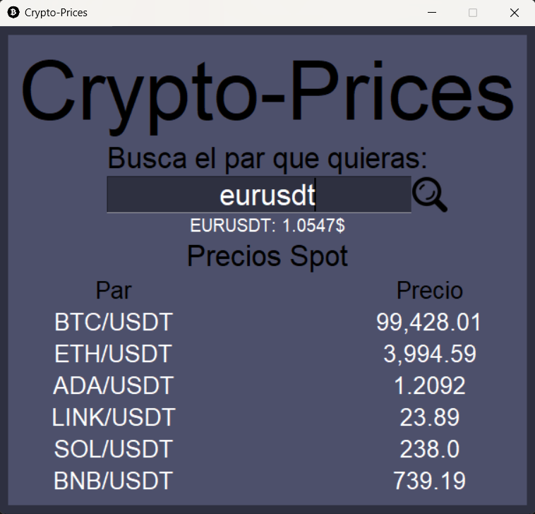

# Crypto Prices App 🪙

Una aplicación de escritorio que muestra en tiempo real los precios de las principales criptomonedas usando la API de Binance.

## 🖼️ Captura

## 📋 Características

- Visualización en tiempo real de precios de criptomonedas
- Búsqueda de cualquier par de trading disponible en Binance
- Interfaz gráfica intuitiva y amigable
- Actualización automática de precios

## 🔧 Instalación

1. Clona el repositorio
2. Crea un entorno virtual
3. Instala las dependencias (requirements.txt)

## 🚀 Uso

Para ejecutar la aplicación basta con ejecutar el archivo main.py

## 🛠️ Tecnologías Utilizadas

- Python 3.11
- Tkinter para la interfaz gráfica
- API de Binance para datos en tiempo real
- Threading para actualizaciones asíncronas